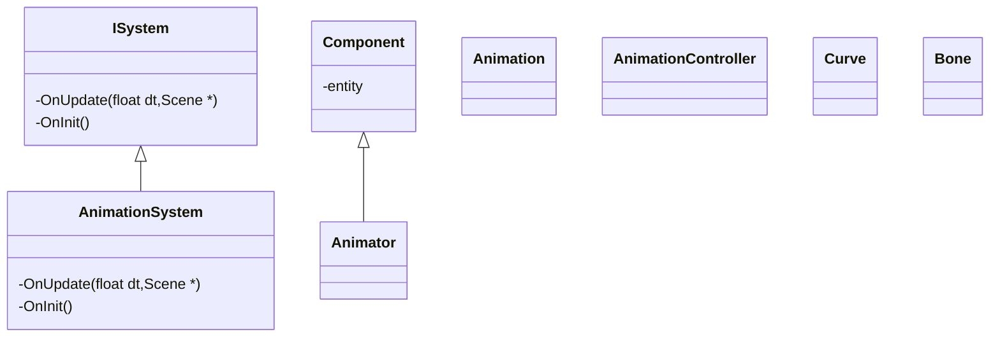
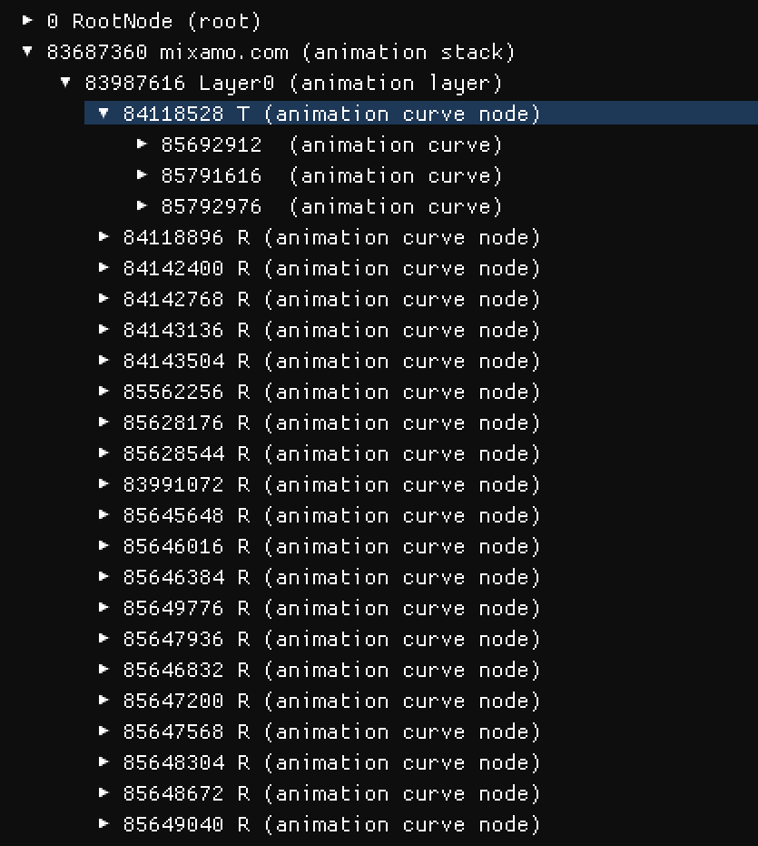
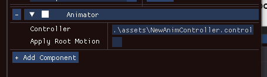
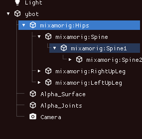
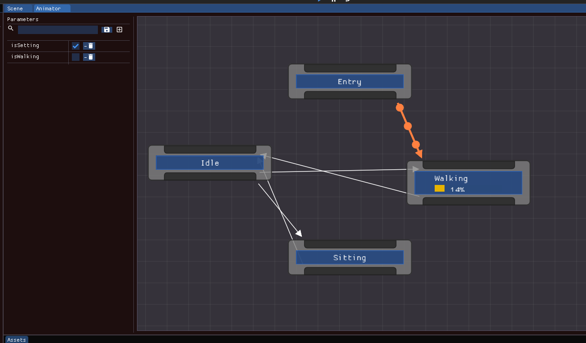
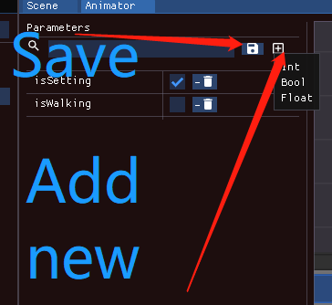
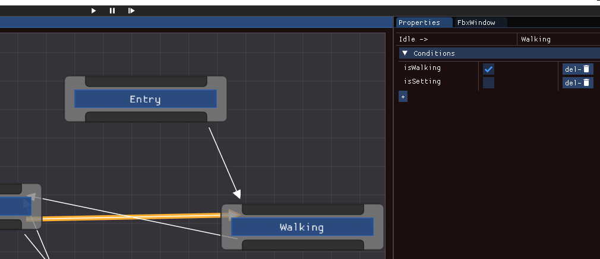

# Animation Architecture

## [Animation](./Animation.h)

The animation is based on skinnedMesh and read from FBX file.

for the animation, it has two components, one is **Animation Clip**, another one is **Animation Curve**.

## Architecture




### [Animation System](./AnimationSystem.h)

In animation system, it is implemented from ISystem interface. So it handles objects which own the **Animator Component**


###  Animation Clip
Animation Clips are the smallest building blocks of animation. They represent an isolated piece of motion, such as RunLeft, Jump, or Crawl, and can be manipulated and combined in various ways to produce lively end results.


### Animation Curve

In an Animation Clip, any animatable property can have an **Animation Curve**, which means that the Animation Clip controls how that property changes over time

For every **Curve**, which will apply changes into a specific bone. So, the curve bind with bone's transform.

**Tips.1 The first state in a Animation will set the model into init pos. Code likes this**

```c++

glm::vec3 pos;
if (firstState) // first time to execute animation
{
    pos = localPos * weight; //set back into the first pose
}
else //after that accumalate changes over time.
{
    pos = target->GetLocalPosition() + localPos * weight;
}
target->SetLocalPosition(pos);

```




## [SkinnedMeshRenderer](../Scene/Component/MeshRenderer.h)

Bones are invisible objects inside a skinned Mesh that affect the way the Mesh is deformed during animation. Bones are joined together to form a hierarchical “skeleton”, and rotating the joints of the skeleton to make it move defines the animation. Each bone is attached to some of the vertices of the surrounding Mesh. When you play the animation, the vertices move with the bone or bones they are connected to, so the “skin” follows the movement of the skeleton. At a simple joint (for example, an elbow), the Mesh vertices are affected by both of the bones that meet there, and the Mesh stretches and rotates realistically as the joint bends. In more complex situations, more than two bones affect a particular area of the Mesh, resulting in more subtle movements.


### The process of bone calculation


Calculate the the WorldSpace for bones

***1.BoneWorldMatrix = Bone.localToWorldMarix * Bone.OffsetMatrix***

Every **4** bones will control a vertex, the transform of a vertex is 

***2.Vertex(world) = bone_0 * weights_0 + bone_1 * weights_1 + bone_2 * weights_2 + bone_3 * weights_3***

## [Animator](./Animator.h)
**Animator is a component which represents that current entity has ability to execute different animation.**

**Params(1):Controller. Controller is a state machine and control how to switch different animation over time and conditions**



**Params(2):Apply Root Motion, It is not implemented now**

## [Animation Controller](./AnimationController.h)

It is a controller that controls conditions and judge what animation will be played in current frame. in fact, AnimationController contains a state machines.

*for Serialization,It is a json file include the links, nodes, conditions*


## [Skeleton](./Skeleton.h)

## [Bone](./Bone.h)

Recording bone's name, index, transform in a skeleton.


## [Editor](../../../Editor/Source/NodeWindow.h)


Currently, the editor support connecting different state, and set parameters for every links.



In the left window, the are two buttons, one is saving current workspace, another one is add new params to current **Animator**



if you click some specific link, you can add conditions for every link.
When all conditions pass, the controller will execute next animation.

**But for current version, Editor support deleting link,not support deleting node**



## Fbx File Structure

TO be  continue....
