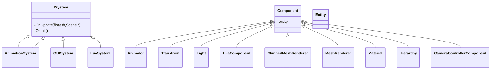

## ECS Architecture





#### [Entity](./Entity/Entity.h)


It 's a wrapper of entt::entity

#### [EntityManager](./Entity/EntityManager.h)

EntityManager manage a scene's all entites. In fact, it is a wrapper of entt::registry.


#### [EntityFactory](./Entity/EntityFactory.h)

Create some pre-defined entites

TODO


#### Use case 

how to iterate entities with components

##### Basic usage for entt::view
``` c++
    auto & registry = scene->GetRegistry();  
    //get all entities without Hierarchy component
    auto nonHierarchyView = registry.view<Transform>(entt::exclude<Hierarchy>);
    //get all entities which have Transform and Hierarchy components
    auto view = registry.view<Transform, Hierarchy>();

    for(auto entity: view) {
        // a component at a time ...
        auto &transform = view.get<Transform>(entity);
        auto &hierarchy = view.get<Hierarchy>(entity);
        // ... multiple components ...
        auto [trans, hier] = view.get<Transform, Hierarchy>(entity);
        // ... all components at once
        auto [trans, hier] = view.get(entity);
        // ...
    }

```

##### Basic usage for entt::group

Groups are meant to iterate multiple components at once and to offer a faster alternative to multi component views

``` c++
    //Model is a kind of Entity.
    //So, in here. We can get all entites which have Model and Transform
    auto group = registry.group<Model>(entt::get<Transform>);
    for(auto entity : group)
    {
        const auto& [model, trans] = group.get<Model, Transform>(entity);

        const auto& meshes = model.GetMeshes();

        for(auto mesh : meshes)
        {
            if(mesh->GetActive())
            {
                //do you job
                SubmitMesh();
            }
        }
    }

```


#### [Scene](./SceneManager.h)

**No-Copyable**

Contains a unique sceneGraph and entityManager. 
 
Important methods :

 **Serialize(const std::string& )**  
 **Load(const std::string& )** 


#### [SceneManager](./SceneManager.h)

It is not **copyable** and manages all scenes at runtime.

the most important method is **GetCurrentScene() const** which will returen the current scene. the scene is not null.


#### [SceneGraph](./SceneGraph.h)

Organize entities and decide which entity will be updated.


### Components 

##### [Active](./Component/Component.h)
##### [Name](./Component/Component.h)
##### [Hierarchy](./Component/Component.h)

##### [Light](./Component/Light.h)
##### [Model](./Component/Model.h)
##### [Transform](./Component/Transform.h)


### System 

A system is a tool that operates on a collection of entities with one or more identical components. It has only behavior and no state, that is, it should not store any data. 

#### ISystem

the interface of your system module


#### SystemManager

the manager of systems and manage the lifecycle of systems.


#### Example


``` c++
    //define your own system here
    class UISystem : public ISystem
    {
        //do you code
    }


    void UISystem::OnUpdate(float dt, Scene* scene)
    {
        //update your entity or component here.        
    }

    auto ui = systemManager->AddSystem<UISystem>();
    ui->OnInit();


```


``` c++
    //define your own system here
    class PhysicsSystem : public ISystem
    {
        //do you code
    }


    void PhysicsSystem::OnUpdate(float dt, Scene* scene)
    {
        auto group = registry.group<Physics3DComponent>(entt::get<Transform>);  
        for(auto entity : group)
        {
           const auto& phys = group.get<Physics3DComponent>(entity);
           phys.OnUpdate();
        }
    }

    auto ui = systemManager->AddSystem<PhysicsSystem>();
    ui->OnInit();


```


### How to add component into editor

##### [Open PropertiesWindow.cpp](../../../Editor/Source/PropertiesWindow.cpp)


```c++
void PropertiesWindow::OnSceneCreated(Scene* scene)
{
.........................
    TRIVIAL_COMPONENT(Transform,true);
    TRIVIAL_COMPONENT(Light, true);
    TRIVIAL_COMPONENT(Camera, true);
    TRIVIAL_COMPONENT(CameraControllerComponent, true);
    TRIVIAL_COMPONENT(MeshRenderer, false);
    TRIVIAL_COMPONENT(SkinnedMeshRenderer, false);
    TRIVIAL_COMPONENT(LuaComponent, true);
    TRIVIAL_COMPONENT(Animator, true);
    //Add your Component in here. The second param means whether it shows in editor
    //Becase for some Component like SkinnedMeshRenderer, there is no need to show 
    //in editor

    enttEditor.addCreateCallback([&](entt::registry & r, entt::entity entity) {
        auto lua = r.try_get<LuaComponent>(entity);
        if (lua) 
        {
            lua->SetScene(editor.GetModule<SceneManager>()->GetCurrentScene());
        }
    });
}

```
**If you want to serialize your component with scene, add your component int Scene.cpp**

```c++
#define ALL_COMPONENTS Transform, NameComponent, ActiveComponent, Hierarchy, Camera, Light, CameraControllerComponent, Model,LuaComponent,MeshRenderer,SkinnedMeshRenderer,Animator

Append your component behind them.

```


