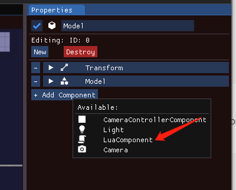
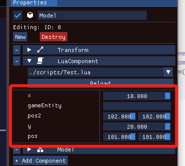
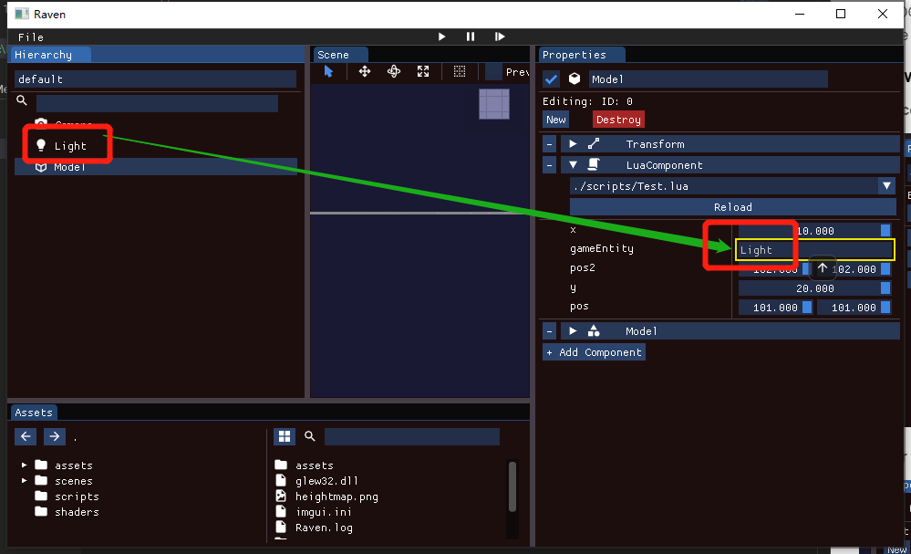

## Lua Script

#### [LuaComponent](./LuaComponent.h)

It 's a component of engine

#### [LuaVirtualMachine](./LuaVirtualMachine.h)

LuaVirtualMachine manage a lua's vm life cycle. In fact, it is a wrapper of lua_State.


#### [LuaSystem](./LuaSystem.h)


LuaSystem extends from ISystem, it is a kind of System which will be managed by ECS(SystemManager)


### Use case 

how to export c++ function to lua 

#### 1. Basic usage for exporting class 
  
``` c++

luabridge::getGlobalNamespace(L)
.beginClass <Entity>("Entity")
.addConstructor <void (*) (entt::entity, Scene*)>()
.addConstructor <void (*) ()>()
.addFunction("Valid", &Entity::Valid)
......
.endClass();

```

Please see [MathExport](./MathExport.cpp) or [ComponentExport](./ComponentExport.cpp) more details about how to export


#### 2. Basic usage in lua

###### 1. define a class

``` lua
local Test = {};

function Test:OnInit()
--do your init code here
end


function Test:OnUpdate(dt)
--do your update code here
end

return Test;
```


###### 2. After we export components and others c++ class, we can use them in lua

``` lua

function Test:OnInit()
--do your init code here
    self.pos = glm.vec2(10,10)
    self.pos2 = glm.vec3(10,10)

    if Input.IsKeyDown(KeyCode.A) then 
        LOGV("xxxxx")
    end

end
```
###### 3. Get other components

- because Script is loaded as a component, if you need to read components you need to get Entity which is parent of this script


``` lua
-- the API of getComponent is Get#ComponentName
[[-- 
    GetNameComponent
    GetActiveComponent
    GetTransform
    GetLight
    are availiable 
--]]
function Test:GetComponentDemo()
    local nameComp = self.parent.GetNameComponent()
    local activeComp = self.parent.GetActiveComponent()
    local transform = self.parent.GetTransform()
end

```
###### 4. Current Exported Class

- Transfrom
- Light
- Entity
- Input
- glm::vec2 / vec3 / vec4 / mat4
- LOGE / LOGV / LOGC / LOGI

- the API is same with c++

#### 3. How to mount a script

###### 1.add component and choose a Lua file



###### 2. after the file loaded, all params will be loaded int editor like unity



###### 3. if the param is class Entity, Entities can be draged into file and loaded into lua environment.



##### 4. for the third one, it will generate a meta file to save params when you modified them in editor.
